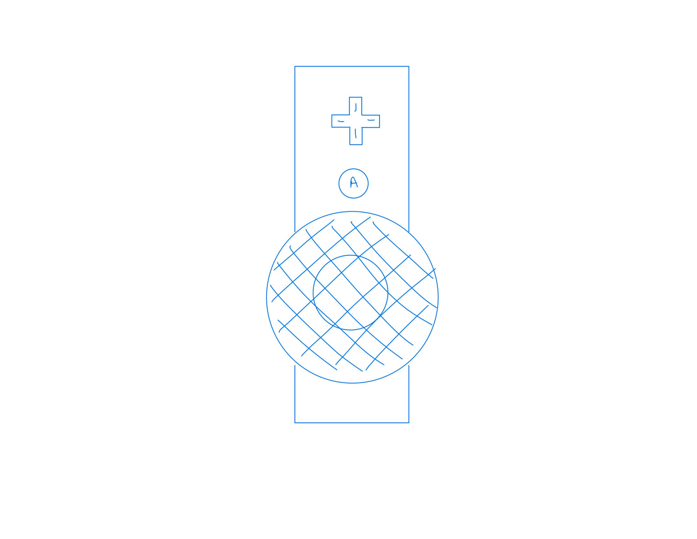
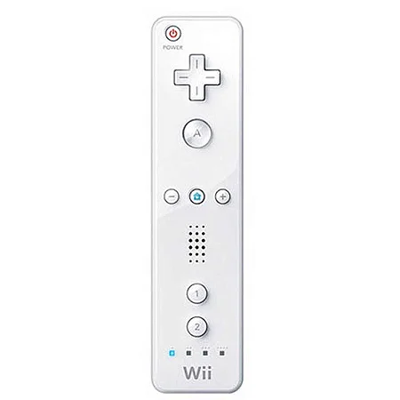
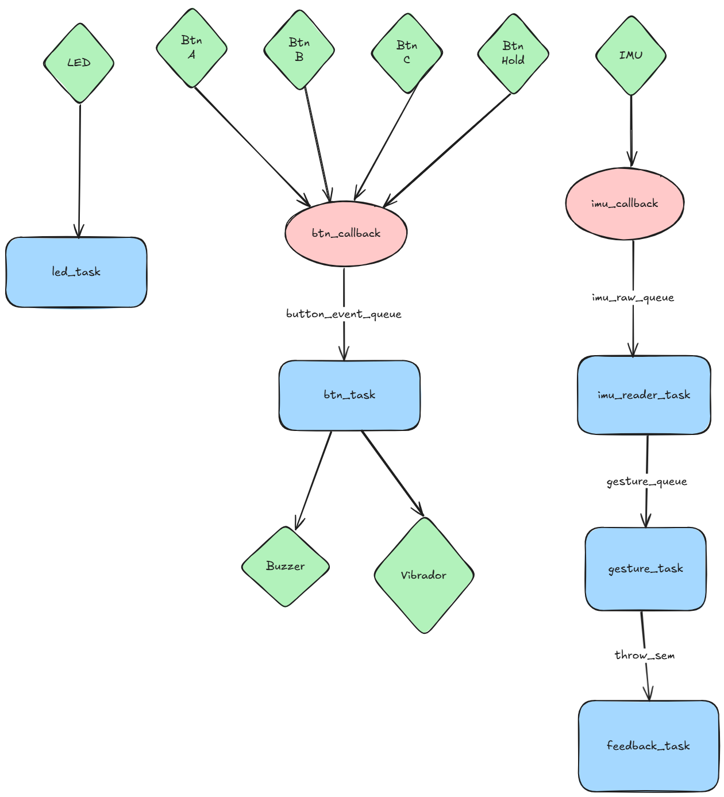

# 🎳 Controle de Bowling — Wii Sports
 
Projeto de computação embarcada que implementa um controle personalizado para o jogo **Wii Sports Bowling**, simulando a experiência do controle original do Wii com detecção de movimento via IMU.
 
---
 
## Jogo
 
**Wii Sports — Bowling**
 
O jogo simula uma partida de boliche em que o jogador realiza o movimento físico de arremessar a bola. O controle detecta o gesto de arremesso e o traduz em comandos de entrada compatíveis com o console Wii ou emulador (Dolphin).
 
---
 
## Ideia do controle
 
O controle foi projetado para se assemelhar visualmente ao Wiimote original, com:
 
- **4 botões no topo** — correspondentes às ações do jogo (confirmar, cancelar, giro, opções)
- **1 botão na parte inferior** — botão de gatilho/hold para segurar a bola durante o swing
- **1 speaker** — feedback de áudio ao arremessar
O gesto de arremesso é detectado pelo IMU: o jogador segura o botão inferior, realiza o movimento de balanço e solta o botão no momento do arremesso — reproduzindo fielmente a mecânica do jogo original.
- **1 LED** - controle conectado.
 
| Sketch do projeto | Controle real (referência) |
|:-----------------:|:--------------------------:|
|  |  |
 
---
 
## Inputs e Outputs
 
### Inputs (sensores)
 
| Componente | Tipo | Função |
|---|---|---|
| Botão A | Digital — GPIO | Confirmar / ação principal |
| Botão B | Digital — GPIO | Cancelar / ação secundária |
| Botão C | Digital — GPIO | Giro / efeito lateral |
| Botão Hold (inferior) | Digital — GPIO | Segurar a bola durante o swing |
| IMU (acelerômetro + giroscópio) | Analógico — SPI/I²C | Detectar movimento de arremesso, intensidade e spin |
 
### Outputs (atuadores)
 
| Componente | Tipo | Função |
|---|---|---|
| Digital — PWM | Feedback visual de estado (idle, swing, arremesso) |
| Buzzer | Digital — GPIO/PWM | Feedback de áudio ao soltar a bola |
| Motor de vibração (rumble) | Digital — GPIO | Vibração ao detectar arremesso |
| USB HID | Protocolo | Envio dos comandos ao console/emulador |
 
---
 
## Protocolo utilizado
 
O controle se comunica via **USB HID (Human Interface Device)**, emulando um gamepad padrão. Os reports HID carregam:
 
- Estado dos botões (bitmask)
- Magnitude do arremesso (0–255), derivada da aceleração de pico do IMU
- Componente de spin (eixo lateral do giroscópio)
A leitura do IMU utiliza **SPI** (ou I²C dependendo do modelo escolhido), com transferência via **DMA** para não bloquear o firmware durante a aquisição de dados.
 
---
 
## Diagrama de blocos do firmware
 
O firmware segue a arquitetura de um RTOS com tasks independentes, desacopladas por filas e sincronizadas por semáforos.
 

 
### Tasks
 
| Task | Descrição |
|---|---|
| `imu_reader_task` | Leitura periódica do IMU via DMA |
| `gesture_task` | Detecção do gesto de arremesso (intensidade e spin) |
| `button_task` | Debounce e estado dos botões |
| `feedback_task` | Controla LED, buzzer e rumble |
 
### Filas (Queues)
 
- `button_event_queue` — eventos brutos dos botões (postados pelas ISRs)
- `imu_raw_queue` — samples brutos do IMU (postados pelo DMA callback)
- `gesture_queue` — gestos interpretados, consumidos pela 

### Semáforos
 
- `throw_sem` (binário) — sinaliza arremesso detectado para a `feedback_task`

### ISRs e Callbacks
 
- `ISR_btn_A/B/C/Hold` — GPIO edge, posta evento em `button_event_queue`
- `imu_dma_callback` — fim de transferência SPI/I²C, posta sample em `imu_raw_queue`